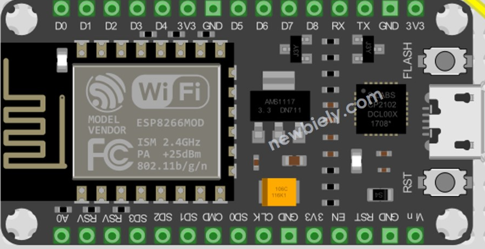
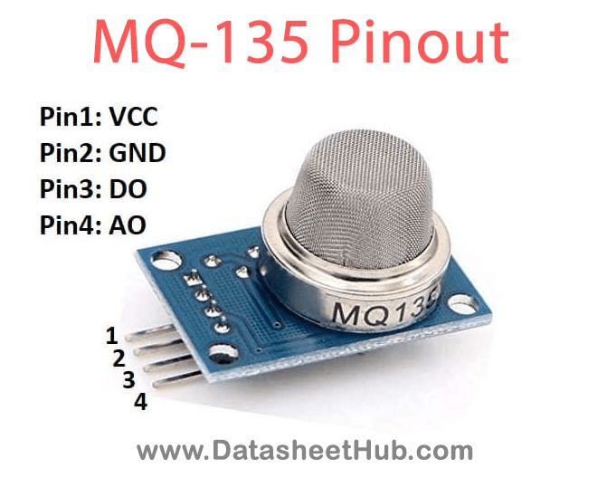
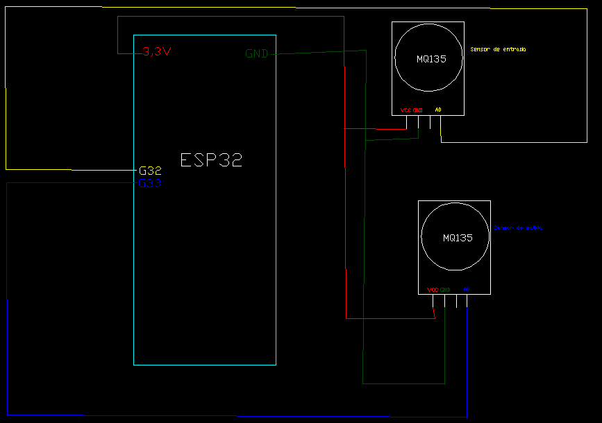

# Purificador de Aire Solar

## Descripción del Proyecto
Nuestro proyecto consiste en un purificador de aire recargado a energía solar. En el acoplamos la placa ESP32 con el objetivo de incorporarle sensores MQ135 tanto en la entrada como en la salida del extractor de aire, con la finalidad de medir la calidad del aire tanto de entrada como de salida.

Todos los valores obtenidos por los sensores son mostrados en tiempo real a través del servidor creado en la placa, la cual gracias a su módulo WiFi puede conectarse a través de la creación de su red a un celular o computadora.

## Componentes Utilizados
- Placa ESP32
- Sensores MQ135
- Protoboard
- Cables de conexión

### Placa ESP32

### Sensor MQ135

## Esquemático de Conexión
A continuación se muestra el esquemático de conexión del purificador de aire solar:

## Instalación
Para su conexión nos basamos en las líneas de código, las cuales determinaban cuál era el sensor de entrada y cuál el de salida. Gracias a esto sabemos que debemos conectar A0 del sensor de entrada al pin G32, y el A0 del sensor de salida al pin G33. Ambos estarán conectados a 3.3V y a GND.

Para su funcionalidad en el proyecto, el sensor de entrada está sujeto a la entrada del extractor y el de salida está montado en la salida a tres centímetros de la boca del extractor de aire.

## Conexión WiFi
Para poder acceder al servidor, el cual en su interfaz muestra los valores de entrada y salida de los sensores, se debe buscar la red WiFi de la placa ESP32, insertar la contraseña `12345567890` y una vez conectado se podrá interactuar en la misma, observando los valores.

---

Proyecto realizado por:
- Barraza
- Carbajales
- Cuello
- DelCastaño

