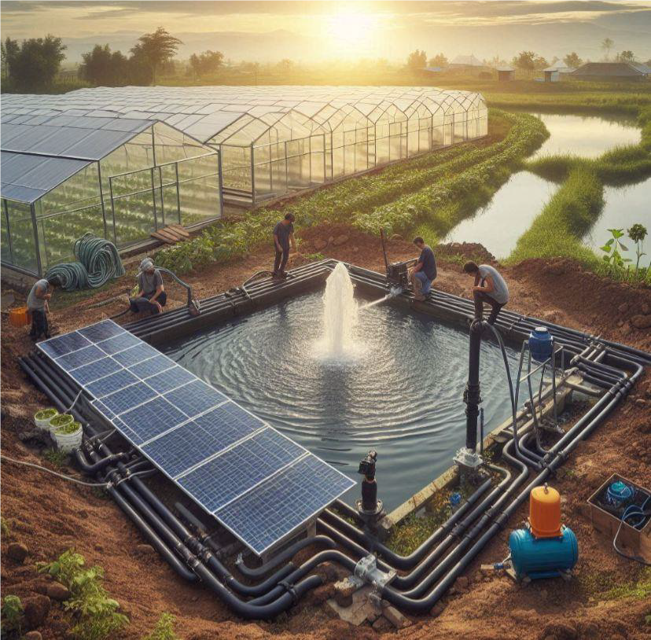
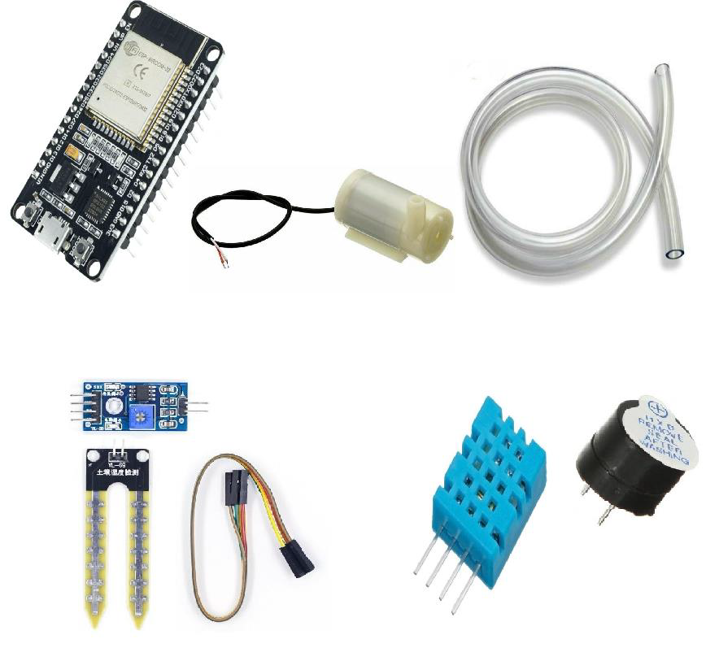
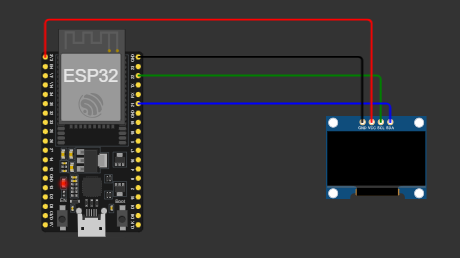

# 🌿 Diseño y Construcción de un Invernadero Eficiente y Sostenible 🌱

El cambio climático y la creciente demanda de alimentos han impulsado la necesidad de producir de manera eficiente y sostenible. En este contexto, la agricultura controlada mediante invernaderos ofrece un entorno controlado y seguro para el cultivo de plantas, protegiéndolas de factores externos como el clima extremo, plagas e insectos. Sin embargo, para que sea realmente eficiente, es esencial la integración de tecnologías que permitan automatizar el riego, monitorear las condiciones ambientales y optimizar el uso de recursos como el agua y la energía. Este proyecto tiene como objetivo desarrollar un invernadero con un sistema automatizado de monitoreo y control, utilizando energía solar y tecnologías de bajo consumo para maximizar la producción mientras se minimiza el impacto ambiental.

## 🎯 Objetivo General

- Diseñar y construir un invernadero automatizado, sostenible, con escalabilidad, optimizando el control de riego y variables ambientales para mejorar la productividad agrícola y reducir el uso de recursos.

## 📋 Objetivos Específicos

- 🤖 Automatizar el sistema de riego en función de la humedad del suelo.
- 🌡️ Monitorear las condiciones ambientales en tiempo real (temperatura y humedad del ambiente).
- ❄️ Regular la temperatura del invernadero mediante un sistema de refrigeración.
- ☀️ Utilizar un sistema de energía renovable (paneles solares) para el funcionamiento autónomo del invernadero.
- 📱 Incorporar una interfaz de monitoreo remoto para controlar el sistema de riego y recibir alertas en caso de problemas.

## 📚 Marco Teórico

### Principios de Automatización en Agricultura
La automatización en la agricultura permite controlar parámetros críticos del entorno de cultivo de manera precisa. Al automatizar procesos como el riego, se reducen las intervenciones manuales y se optimizan los recursos.

### Importancia del Control de Variables Ambientales
El crecimiento y desarrollo de las plantas dependen de factores como la temperatura, la humedad y la calidad del suelo. Mantener estos parámetros dentro de rangos óptimos ayuda a maximizar la producción y mejorar la calidad de los cultivos.

### Tecnología en la Automatización: ESP32
El ESP32 es un microcontrolador versátil que incluye conectividad WiFi y Bluetooth, ideal para el desarrollo de aplicaciones IoT. Con su bajo consumo de energía y múltiples puertos de entrada y salida, permite la conexión de sensores y actuadores que pueden controlarse de forma remota y automatizada.

### Sensores y Actuadores
- 🌱 **Sensor de Humedad del Suelo**: Detecta los niveles de humedad y activa el riego si están por debajo del umbral establecido.
- 🌡️ **Sensor DHT**: Mide la temperatura y humedad del ambiente para monitorear condiciones críticas.
- 🚨 **Buzzer**: Se usa como alarma para advertir sobre condiciones extremas en tiempo real.
- 💧 **Bomba Sumergible**: Ejecuta el riego según los datos de los sensores.

## 📐 Esquemático del Sistema

A continuación, se presenta el circuito esquemático del sistema automatizado del invernadero:

## 🛠️ Diseño del Sistema

- **Estructura del Invernadero**: Dimensiones de 20 m de largo, 10 m de ancho y 4.12 m de altura, utilizando un techo de policarbonato de 6 mm y malla sombra en las paredes.
- **Sistema de Riego**: Riego por goteo con bomba sumergible, filtro y emisores de riego.
- **Automatización**: Uso del ESP32 para controlar sensores de humedad del suelo y ambiente, y activar el riego según las condiciones.

## 🧪 Metodología

### Desarrollo del Software
- Configuración de sensores y programación del ESP32 para activar la bomba automáticamente cuando la humedad del suelo esté por debajo de un umbral (por ejemplo, 20%).
- Configuración del sensor de temperatura y humedad “DHT” para activar el sistema de ventilación mediante la ESP32.
- Configuración de alarmas usando el buzzer para alertar sobre condiciones de temperatura o humedad críticas.
- Programación de una interfaz de monitoreo remoto (opcional).

### Pruebas
- Simulación de condiciones de sequedad para activar el sistema de riego.
- Ajustes en los tiempos de riego y límites de sensores según resultados de las pruebas.
- Simulación de condiciones extremas para probar el sistema de alarmas.

## 📈 Resultados Esperados

- 💧 Reducción en el consumo de agua mediante un sistema de riego por goteo automatizado.
- 🌾 Mejora de la productividad del invernadero en al menos un 20% gracias al control óptimo de variables ambientales.
- 💸 Reducción de costos operativos al utilizar energía renovable (paneles solares).
- 📊 Un sistema de monitoreo eficiente y en tiempo real, con alertas en caso de condiciones adversas.

## 🎥 Video Demostrativo

A continuación, se presenta un video demostrativo del principio de funcionamiento del invernadero automatizado:

## 🖥️ Simulación en Wokwi

Para visualizar a la simulacion del sistema automatizado del invernadero, puede acceder al siguiente enlace en Wokwi:

https://wokwi.com/projects/416571348841677825

## 🏁 Conclusión

Este proyecto combina automatización, monitoreo remoto y energías renovables para optimizar la producción agrícola. El diseño fomenta el uso responsable de recursos, promueve la sostenibilidad y ofrece un modelo replicable que puede adaptarse a distintos cultivos y contextos debido a su escalabilidad.

