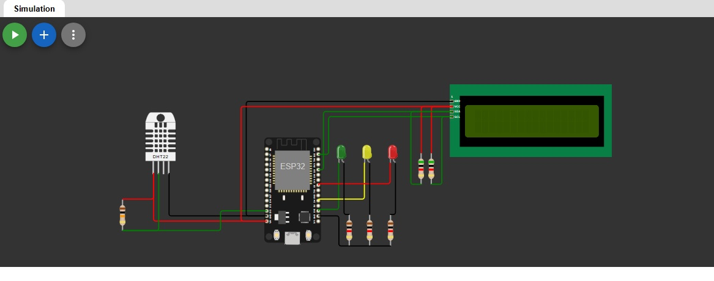
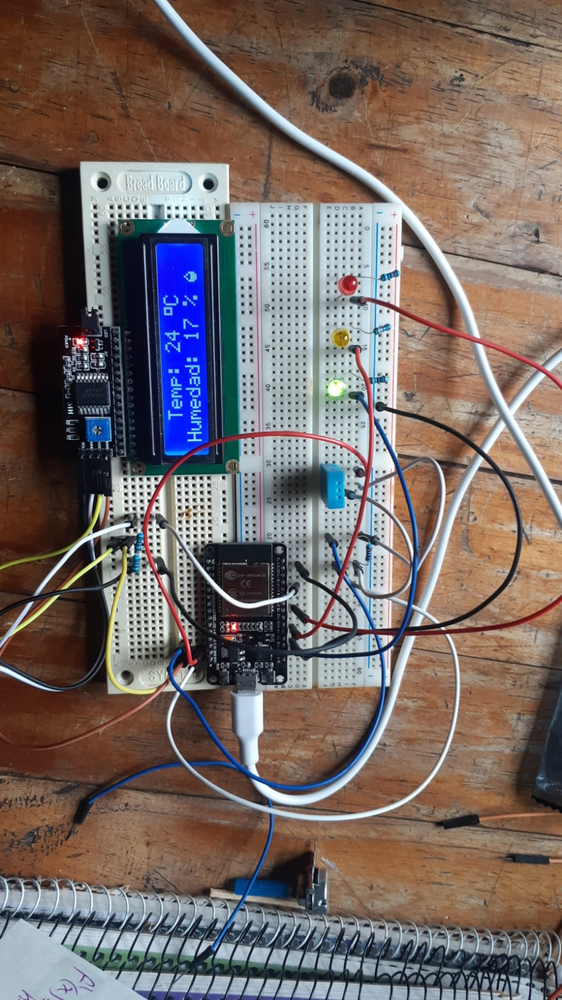

# 🌡️ Proyecto: **Control de Temperatura**

## 📝 Descripción
**Control de Temperatura** es un proyecto final para el curso *"Introducción a Python y MicroPython"*. Este proyecto tiene como objetivo el diseño de un sistema que controle y monitorice la temperatura utilizando MicroPython, una versión optimizada de Python para microcontroladores. En este sistema, se conecta un sensor de temperatura a un microcontrolador ESP32, y se gestionan los datos obtenidos para visualizarlos en un display LCD 16x2.

## 💻 Lenguaje
El proyecto está desarrollado en **MicroPython**, una implementación ligera de Python para dispositivos con recursos limitados, ideal para proyectos de hardware como este.

## ⚙️ Funcionalidades
- **📈 Lectura de temperatura**: Captura de la temperatura en tiempo real desde un sensor (como un DHT11 o DS18B20).
- **🔧 Control de actuadores**: Dependiendo de la temperatura, el sistema puede encender o apagar un ventilador o una lámpara de calor.
- **📊 Visualización de datos**: Monitoreo de la temperatura en una interfaz simple como un display LCD 16x2.

## 👥 Integrantes
- **Cristian José Pérez**
- **Carlos Gabriel Juarez Guride**
- **Lucas Robles**

## 📋 Requisitos
- Microcontrolador ESP32
- Sensor de temperatura DHT11
- Display LCD 16x2
- IDE compatible con MicroPython Thonny

## 🔌 Esquemático del Circuito
A continuación se muestra el esquemático del circuito utilizado en este proyecto:



## 🛠️ Imagen del Circuito en Protoboard
A continuación se muestra una imagen del circuito montado en una protoboard:



## 🎥 Video Demostrativo

A continuación, se presenta un video demostrativo del principio de funcionamiento del invernadero automatizado:

https://github.com/user-attachments/assets/5a201095-5bf3-43a9-bef6-5d2e6401a550

## 🛠️ Instalación
1. Clonar el repositorio en tu computadora:
   ```bash
   git clone https://github.com/Guts3r2/Proyecto-Micropython
   ```
