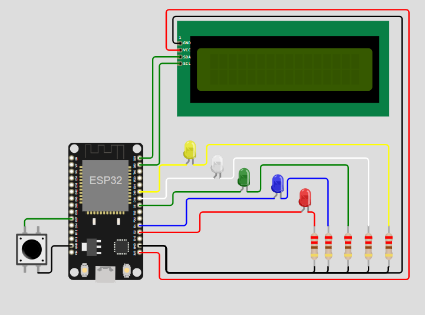

# 🛠️ Proyecto: Control de LEDs con ESP32

## 📄 Descripción
Este proyecto utiliza un ESP32 programado en **MicroPython** para controlar una serie de LEDs mediante diferentes patrones de iluminación. Además, incluye un botón para cambiar entre los modos de funcionamiento y un LCD opcional para mostrar información.

---

## ⚙️ Implementación

### 1. 🖥️ Preparación del Hardware
#### Componentes necesarios:
- **ESP32** (microcontrolador).
- **5 LEDs** (para efectos visuales).
- **1 botón** (para cambiar entre modos).
- **Resistencias de 220Ω** (para proteger los LEDs).
- **LCD I2C** (opcional para mostrar el estado).
- Protoboard y cables de conexión.

#### Conexiones principales:
- **LEDs**: Conecta cada LED a un pin digital del ESP32 (GPIO 2, 4, 5, 18, 19) mediante una resistencia de 220Ω.
- **Botón**: Conecta el botón al GPIO 27 con una resistencia pull-up integrada.
- **LCD**: Conecta el LCD I2C a los pines GPIO 22 (SCL) y GPIO 23 (SDA).

---

## 🛠️ Lógica del Programa

### **Inicio del Sistema**
1. El ESP32 inicializa los pines GPIO para los LEDs y el botón.
2. Todos los LEDs comienzan apagados.

### **Modos de Funcionamiento:**
- **Modo 0: Parpadeo clásico**  
  Todos los LEDs se encienden y apagan simultáneamente cada 500 ms.

- **Modo 1: Estrella centelleante**  
  LEDs pares e impares alternan entre encendido y apagado.

- **Modo 2: Espiral luminosa**  
  Un LED se enciende en secuencia, con un segundo LED encendido en una posición desplazada.

- **Modo 3: Cascada**  
  Los LEDs se encienden uno a uno en orden inverso, simulando una cascada.

- **Modo 4: Encendido progresivo y apagado escalonado**  
  Los LEDs se encienden desde los extremos hacia el centro y luego se apagan de forma escalonada.

### **Control del Botón**
1. Cada vez que se presiona el botón:
   - Se cambia al siguiente modo (0 → 1 → 2 → 3 → 4 → 0).
   - Se reinicia el paso dentro del nuevo modo.
2. El sistema usa una lógica de "debounce" para evitar lecturas erróneas del botón.

### **Ciclo Principal**
1. Dependiendo del modo actual, se ejecuta el patrón correspondiente.
2. Los cambios en los LEDs ocurren cada 500 ms, controlados por temporizadores.

---

## 📥 Instalación

### 1. Flashear el Firmware de MicroPython  
Asegúrate de que tu **ESP32** esté flasheado con el firmware más reciente de **MicroPython**.  
Sigue las instrucciones [aquí](https://docs.micropython.org/en/latest/esp32/tutorial/intro.html) si es necesario.  
Con **Thonny IDE**, puedes flashear rápidamente el firmware desde el menú:  
`Run > Configure Interpreter > Install or update MicroPython`.

### 2. Configurar el IDE  
Instala **Thonny IDE** o cualquier otro IDE compatible con **MicroPython**.  
Configúralo para comunicarse con tu **ESP32**.

### 3. Subir el Código  
Copia el archivo `main.py` proporcionado y cualquier otro archivo necesario a tu **ESP32** usando el IDE.

---

## 🚀 Escalabilidad
Este proyecto puede ampliarse con las siguientes mejoras:
1. **Mayor cantidad de LEDs:**  
   Incluir más LEDs para patrones más complejos de iluminación.
   
2. **Control remoto con interfaces externas:**  
   - Implementar comunicación por Bluetooth o WiFi para cambiar los modos sin usar el botón físico.
   
3. **Sensores adicionales:**  
   - Integrar sensores de luz o movimiento para activar automáticamente los patrones según el entorno.

4. **Efectos personalizados:**  
   - Crear nuevos modos de iluminación, como efectos aleatorios o sincronización con audio.

---

## 🎥 Video
Puedes ver el video de la prueba del proyecto en el siguiente enlace:  
[**Video del Proyecto - YouTube**](https://youtu.be/Al2GBAFVN3g)

---

## 🎥 Simulación

### 🌟 Vista Previa de la Simulación

### 🔗 Enlace al Proyecto  
Haz clic aquí para probar la simulación: [**Wokwi - Proyecto ESP32**](https://wokwi.com/projects/415929877707441153)

## 📚 Bibliografía
1. **Pantalla LCD 16x2**   
   [datasheet](https://www.openhacks.com/uploadsproductos/eone-1602a1.pdf)

2. **I2C**
   [datasheet](https://www.nxp.com/docs/en/user-guide/UM10204.pdf)

---

## 👨‍🎓 Autor
- **Nombres:** Julieta Padula y Santiago Sardi 
- **Curso:** Introducción a MicroPython  
- **Fecha:** 30-11-2024
