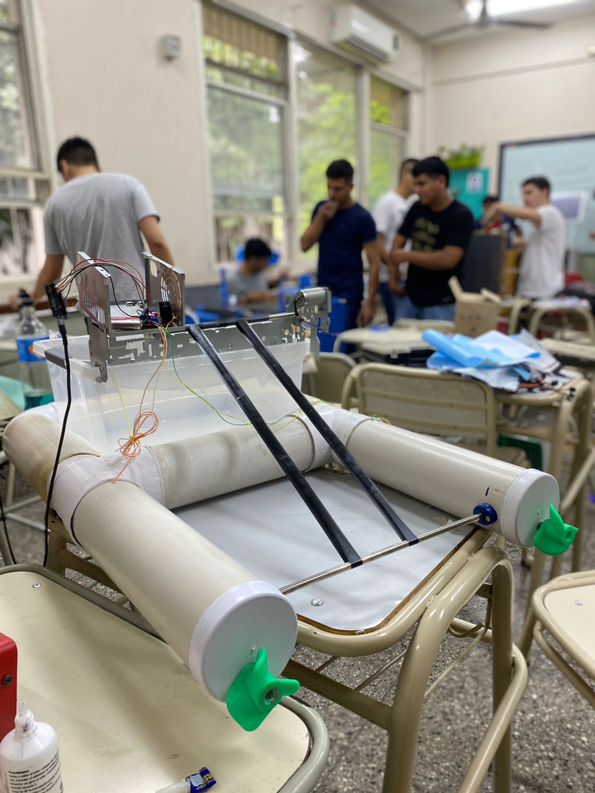

## Proyecto: Barco recolector de basura
Somos grupo de compañeros conformado por Teri Santiago y Paz Juan Pablo. Nosotros desarrollamos este proyecto que consiste en un barco recolector de basura, llevarlo a lagos y ríos para que el mismo haga su trabajo que es recolectar residuos humanos, con la mira de obtener un mejor ecosistema.

### 📸 Foto del prototipo:

### 🛠️ Hardware:
- 2 Placas ESP-32
- Un Puente H Driver L298N
- Un sensor ultrasonico

### 💻 Software y armado:
Comenzamos por hacer el comunicado entre las placas ESP-32 mediante el código de ESP-NOW. Una de ellas irá al barco y la otra estará en el control remoto del mismo. La placa que está en el barco comanda al Puente H, el cual es el encargado de dar marcha a los motores, y también comanda al sensor ultrasonico que nos dará aviso cuando el contenedor de basura esté lleno. Todo esto lo veremos en los archivos adjuntados en el mismo repositorio.

### 📄 Descripción del Código:
El código está dividido en varias partes:
1. **Conexión ESP-NOW**: Configura la comunicación entre las dos placas ESP-32.
2. **Control de Motores**: Utiliza el Puente H Driver L298N para controlar los motores del barco.
3. **Sensor Ultrasonico**: Mide la distancia y detecta cuando el contenedor de basura está lleno.
4. **Interfaz de Control Remoto**: Permite controlar el barco de forma remota.

### 🚀 Ejecución:
1. Flashea el firmware de MicroPython en ambas placas ESP-32.
2. Sube el código a las placas utilizando Thonny IDE.
3. Conecta los componentes según el esquema de conexión.
4. Enciende las placas y comienza a controlar el barco recolector de basura.

### ⚠️ Consideraciones:
- Asegúrate de que todos los componentes estén correctamente conectados.
- Verifica que las placas ESP-32 estén configuradas correctamente para la comunicación ESP-NOW.

### 🚀 Mejoras futuras:
- Integrar sensores adicionales para mejorar la detección de basura.
- Implementar un sistema de navegación autónoma para el barco.
- Añadir una interfaz web para el control remoto del barco.

### 👥 Participantes:
- Teri Santiago
- Paz Juan Pablo