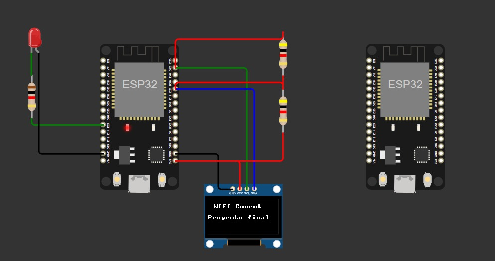
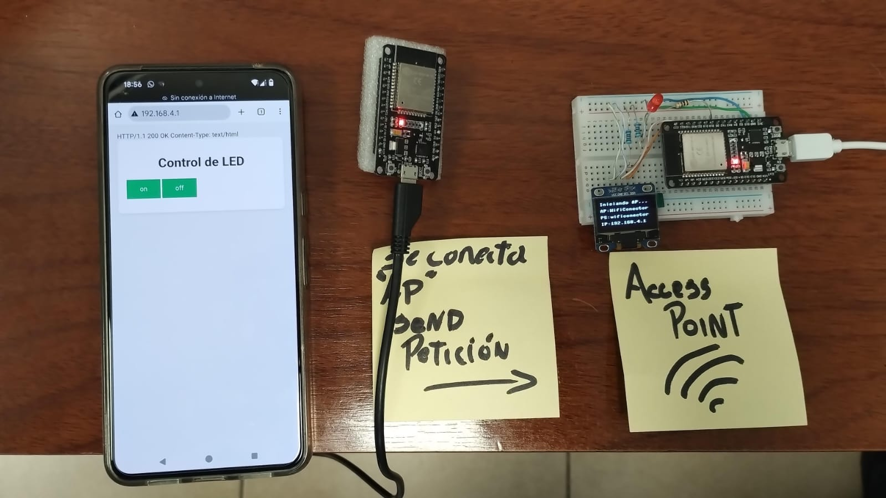

<div align="center">
  <h1>Gestor de Conexión WiFi para ESP32 con Display OLED</h1>
</div>

<div align="center">
  
  []()
  []()
  []()
  []()
</div>

## Tabla de Contenidos

- Introducción
- Características
- Requisitos de Hardware
- Requisitos de Software
- Diagrama de Conexiones
- Instalación
- Uso
- Funcionamiento
- Licencia

## Introducción
Este proyecto implementa un gestor de conexión WiFi para ESP32 utilizando MicroPython. Permite configurar la conexión WiFi a través de un punto de acceso (AP) temporal y muestra el estado en una pantalla OLED SSD1306. El sistema opera en modo dual (AP+STA) permitiendo una configuración sencilla a través de una interfaz web.

## Características
- Modo dual AP+STA (Access Point + Station)
- Interfaz web para configuración WiFi
- Display OLED para mostrar estado
- Almacenamiento seguro de credenciales WiFi
- Reconexión automática
- Protección contra intentos fallidos
- Escaneo de redes disponibles
- Indicador de intensidad de señal

## Requisitos de Hardware
- Dos ESP32 DevKit v1
- Pantalla OLED SSD1306 (128x64)
- Cables de conexión

## Requisitos de Software
- MicroPython v1.24.0 o superior
- Thonny IDE para MicroPython
- Librería ssd1306.py
- Librería conector_wifi.py
- 
## Diagrama de Conexiones
ESP32 OLED Display (SSD1306)
ESP32 Auto conexión
<div align="center">
  

</div>
## Instalación
1. **Flashear MicroPython**: 
   - Instala el firmware MicroPython en tu ESP32
   - Instala Thonny IDE para esto

2. **Instalar Archivos**:
   - Copia `conector_wifi.py` al ESP32
   - Asegúrate de tener la librería `ssd1306.py` instalada

3. **Configuración Inicial**:

En la ESP32 que sera el Access Point
```python
from conector_wifi import ConectorWIFI

# Crear instancia con SSID y contraseña personalizados para el AP
wifi = ConectorWIFI(ap_ssid='MiESP32', ap_password='password123')

# Iniciar en Acces Point
wifi.start_ap()
```

En la ESP32 que se conectara al Acces Point
```python
from conector_wifi import ConectorWIFI

# Crear instancia
wifi = ConectorWIFI()

# conexion al Acces Point
wifi.wifi_connect("MiESP32", "password123")
```

## Uso
1. Al iniciar, el ESP32(1) creará un punto de acceso WiFi
2. Conéctate al AP usando las credenciales mostradas en el display OLED
3. Accede a la página de configuración (http://192.168.4.1)
4. Se Muestra interfaz web para encender y apagar LEd
5. El ESP32(2) se conectará a la red de forma automática y guardará las credenciales
6. Presionando el botón físico se podrá encender y apagar LED

## Funcionamiento

### Access Point / Station 
- **Access Point**: Crea un punto de acceso temporal para configuración
- **Station**: Se conecta a la red WiFi configurada
 <div align="center">
  

</div>

## Video
¡El Proyecto en acción en este video!

<div align="center">
  <video src="https://github.com/user-attachments/assets/bf39a343-9e6c-45a2-b2bc-9c9e87df2c2e"/>
</div>

## Licencia
Este proyecto está licenciado bajo la Licencia MIT. Puedes usar, modificar y distribuir el código libremente, manteniendo la atribución al autor original.

---

Para más detalles sobre la implementación, consulta los comentarios en el código fuente.

