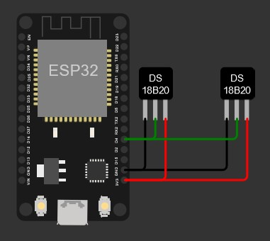
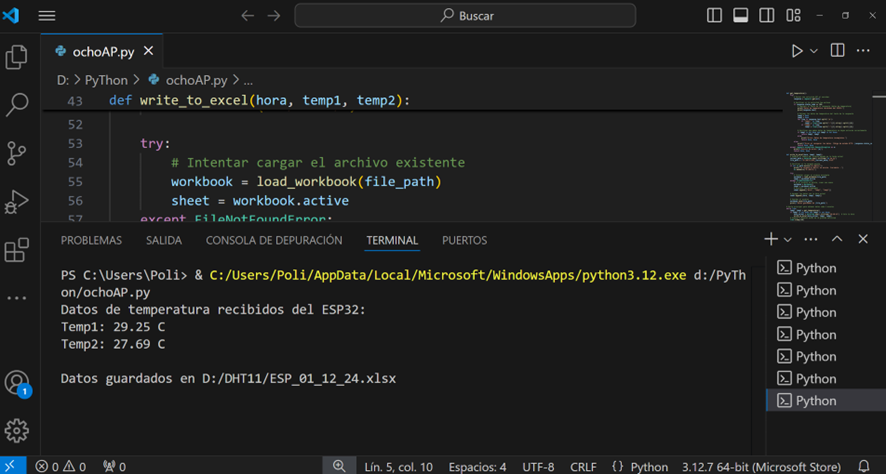
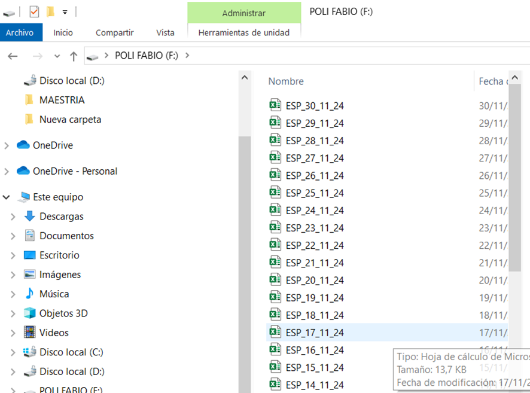
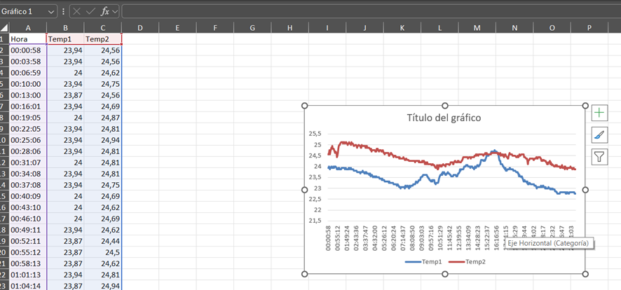

# 📡 Monitoreo y Optimización de Temperatura con ESP32 y DS18B20

## 🏛 Universidad Tecnológica Nacional  
**Facultad Regional Tucumán**  
Curso MicroPython con el ESP32  
Profesor: **Maximiliano Simonazzi** 

## Autores
- Poli Fabio José
- Robra Abel

---

## 📌 **Descripción del Proyecto**  
**Título**: Monitoreo y Optimización de la Temperatura en Habitaciones  

Este proyecto tiene como objetivo optimizar el confort térmico en interiores mediante el monitoreo de temperatura utilizando sensores DS18B20 y un microcontrolador ESP32 configurado como punto de acceso Wi-Fi.

---

## ✨ **Resumen**  
El sistema recolecta datos de temperatura en dos puntos estratégicos de una habitación (cerca y debajo del cielorraso) y los transmite a una notebook para análisis. Con esta información, se ajusta el sistema de climatización para optimizar la eficiencia energética y el confort térmico.

---

## 🧰 **Componentes Utilizados**  
- 🛠 **Hardware**:
  - 2 Sensores DS18B20
  - 1 Microcontrolador ESP32
  - Notebook para análisis de datos
- 🖥 **Software**:
  - MicroPython para ESP32
  - Python para análisis en la notebook

---

## 🔧 **Metodología**  

### 🌐 **Configuración del ESP32**  
1. **Conexión de los sensores**:  
   - Los sensores DS18B20 están conectados al pin GPIO 4 del ESP32 mediante el protocolo OneWire.



2. **Punto de acceso Wi-Fi**:
   - El ESP32 actúa como un punto de acceso Wi-Fi, permitiendo la comunicación con la notebook.

### 📋 **Estructura del Sistema**  
- **Servidor Web en el ESP32**: 
  - El ESP32 envía datos de temperatura en formato HTTP.
- **Recepción en la Notebook**:
  - Python solicita y almacena los datos en un archivo Excel para su análisis.

---

## 📜 **Implementación del Código**  

### 🔌 **ESP32 con MicroPython (main.py)**  

- **Configuración de Sensores**:
```python
import time
import machine
import onewire
import ds18x20
import network
import socket
```
- **time**: Para manejar retrasos y tiempos de espera.
- **machine**: Para interactuar con los pines del ESP32.
- **onewire** y ds18x20: Para manejar la comunicación con los sensores DS18B20.
- **network**: Para configurar la red Wi-Fi.
- **socket**: Para crear un servidor web.

- **Configuración de los Pines y Sensores**:

```python
ONE_WIRE_BUS = 4
dat = machine.Pin(ONE_WIRE_BUS)
ds_sensor = ds18x20.DS18X20(onewire.OneWire(dat))
```
- **ONE_WIRE_BUS** = 4: Define el pin GPIO 4 para la comunicación OneWire.
- **dat** = machine.Pin(ONE_WIRE_BUS): Configura el pin GPIO 4.
 - **ds_sensor** = ds18x20.DS18X20(onewire.OneWire(dat)): Inicializa el sensor DS18B20 en el pin definido.

- **Punto de Acceso Wi-Fi**:

```python
ssid = "ESP32-Access-Point"
password = "prov15888"

ap = network.WLAN(network.AP_IF)
ap.config(essid=ssid, password=password)
ap.active(True)

while not ap.active():
    time.sleep(1)
    print("Configurando punto de acceso Wi-Fi...")

print("Punto de acceso Wi-Fi configurado")
print("Dirección IP:", ap.ifconfig()[0])
```
- **ssid** y **password**: Definen el nombre y la contraseña del punto de acceso Wi-Fi.
- **ap** = network.WLAN(network.AP_IF): Configura el ESP32 como un punto de acceso.
- **ap.config(essid=ssid, password=password)**: Establece el SSID y la contraseña del punto de acceso.
- **ap.active(True)**: Activa el punto de acceso.
- **while not ap.active()**: Espera hasta que el punto de acceso esté activo.
- **print("Dirección IP:", ap.ifconfig()[0])**: Imprime la dirección IP del punto de acceso.

- **Configuración del Servidor Web**:

```python
addr = socket.getaddrinfo('0.0.0.0', 80)[0][-1]
server = socket.socket()
server.bind(addr)
server.listen(1)

print('Servidor escuchando en', addr)
```
- **addr** = socket.getaddrinfo('0.0.0.0', 80)[0][-1]: Obtiene la dirección y el puerto para el servidor.
- **server** = socket.socket(): Crea un socket para el servidor.
- **server.bind(addr)**: Asocia el socket a la dirección y puerto obtenidos.
- **server.listen(1)**: Configura el servidor para escuchar conexiones entrantes.

- **Manejo de Conexiones y Lectura de Temperaturas**:

```python
while True:
    cl, addr = server.accept()
    print('Cliente conectado desde', addr)
    cl_file = cl.makefile('rwb', 0)
    while True:
        line = cl_file.readline()
        if not line or line == b'\r\n':
            break

    roms = ds_sensor.scan()
    ds_sensor.convert_temp()
    time.sleep_ms(750)
    
    temp1 = ds_sensor.read_temp(roms[0])
    temp2 = ds_sensor.read_temp(roms[1])

    response = """\
HTTP/1.1 200 OK\r\nContent-Type: text/plain\r\nConnection: close\r\n\r\n
Temp1: {} C\nTemp2: {} C\n""".format(temp1, temp2)

    cl.send(response)
    cl.close()
    print('Cliente desconectado')
```
- **while True**: Bucle infinito para manejar conexiones entrantes.
- **cl, addr = server.accept()**: Acepta una conexión entrante.
- **cl_file = cl.makefile('rwb', 0)**: Crea un archivo para leer y escribir datos del cliente.
- **while True**: Bucle para leer datos del cliente.
- **if not line or line == b'\r\n'**: Verifica si la línea está vacía o es un salto de línea.
- **roms = ds_sensor.scan()**: Escanea los sensores conectados.
- **ds_sensor.convert_temp()**: Inicia la conversión de temperatura.
- **time.sleep_ms(750)**: Espera 750 ms para que la conversión termine.
- **temp1 = ds_sensor.read_temp(roms[0])**: Lee la temperatura del primer sensor.
- **temp2 = ds_sensor.read_temp(roms[1])**: Lee la temperatura del segundo sensor.
- **response**: Crea la respuesta HTTP con las temperaturas.
- **cl.send(response)**: Envía la respuesta al cliente.
- **cl.close()**: Cierra la conexión con el cliente.

## 📊 **Proceso de Monitoreo (notebook.py)**

**Recepción de Datos en la Notebook**: La notebook se conecta al punto de acceso Wi-Fi del ESP32 y ejecuta un programa en Python que solicita los datos de temperatura cada 30 segundos. Los datos recibidos se almacenan en un archivo Excel para su análisis diario.
Programa en Python para la Notebook

- **Parte 1: Solicitud de Datos de Temperatura**:

Este programa se conecta al servidor web del ESP32, solicita los datos de temperatura cada 30 segundos y los imprime en la consola.

```python
import requests
import time

# URL del servidor ESP32
url = "http://192.168.4.1/"  # Asegúrate de usar la IP correcta del ESP32

def get_temperature():
    try:
        # Enviar una solicitud GET al servidor
        response = requests.get(url)
        
        # Verificar si la solicitud fue exitosa
        if response.status_code == 200:
            # Imprimir el texto de la respuesta (datos de temperatura)
            print("Datos de temperatura recibidos del ESP32:")
            print(response.text)
        else:
            print(f"Error al recuperar los datos. Código de estado HTTP: {response.status_code}")
    except requests.exceptions.RequestException as e:
        print(f"Ocurrió un error: {e}")

# Bucle principal para obtener datos cada 30 segundos
while True:
    get_temperature()
    # Esperar 30 segundos antes de la próxima solicitud
    time.sleep(30)
```

- **Parte 2: Almacenamiento de Datos en un Archivo Excel**:

Este programa crea un archivo Excel y guarda los datos de temperatura recibidos del ESP32.

```python
import os
import pandas as pd
from datetime import datetime

# Ruta de la carpeta y archivo
folder_path = "D:/DHT11"
file_path = os.path.join(folder_path, "ESP32.xlsx")

# Crear la carpeta si no existe
if not os.path.exists(folder_path):
    os.makedirs(folder_path)

def save_temperature(temp1, temp2):
    # Crear un DataFrame con los datos actuales
    now = datetime.now()
    date_time = now.strftime("%Y-%m-%d %H:%M:%S")
    df = pd.DataFrame([[date_time, temp1, temp2]], columns=["Fecha", "Temp1", "Temp2"])
    
    # Guardar los datos en el archivo Excel
    if not os.path.exists(file_path):
        df.to_excel(file_path, index=False)
    else:
        existing_df = pd.read_excel(file_path)
        updated_df = pd.concat([existing_df, df], ignore_index=True)
        updated_df.to_excel(file_path, index=False)

    print(f"Datos guardados en {file_path}")

# Ejemplo de uso
save_temperature(25.5, 26.0)
```

## 📈 **Simulaciones**

**Recepción en la Notebook**



## 📝 **Conclusión**

Este sistema permite monitorear y analizar las temperaturas en diferentes partes de una habitación, proporcionando datos precisos para tomar decisiones informadas sobre el aislamiento térmico y la eficiencia energética. La notebook se conecta al ESP32, recibe los datos de temperatura y los almacena en un archivo Excel para su análisis diario.

**Importancia del Monitoreo**
El monitoreo de la temperatura es fundamental para obtener datos reales y precisos sobre las condiciones térmicas en la habitación. Con esta información, se pueden tomar decisiones informadas para aplicar diferentes soluciones de aislamiento térmico, tales como:

- Pinturas reflectivas.
- Aislantes como Isover.
- Revoques térmicos.
- Paredes con aislaciones térmicas.

Estas soluciones ayudan a mejorar la eficiencia energética y el confort térmico, reduciendo la necesidad de sistemas de climatización y, por ende, el consumo de energía.

**Resultados Esperados**
Se espera obtener un conjunto de datos detallado sobre las variaciones de temperatura en la habitación. Con esta información, se podrán identificar patrones y tomar decisiones para ajustar el sistema de climatización, mejorando así el confort térmico y la eficiencia energética.





**Análisis de la Situación**

- **Línea Celeste**: La temperatura dentro de la habitación varía alrededor de los 23°C, con algunas fluctuaciones.
- **Línea Roja**: La temperatura entre la chapa y el cielorraso muestra un aumento significativo, alcanzando los 25.5°C en algunos momentos.

## Propuesta
**Mejorar el Aislamiento Térmico:**
- Aislamiento de Techo: Agregar material aislante entre la chapa y el cielorraso puede ayudar a reducir la transferencia de calor. Materiales como lana de vidrio, poliestireno expandido (EPS), o poliuretano son efectivos.
- Aislamiento de Paredes: Reforzar el aislamiento en las paredes exteriores para minimizar la ganancia de calor desde el exterior.

**Uso de Ventilación Pasiva y Activa:**
- Ventilación Pasiva: Instalar ventiladores de techo o extractores de aire que permitan la circulación del aire caliente hacia afuera y el ingreso de aire fresco.
- Ventilación Activa: Utilizar sistemas de aire acondicionado o climatización que permitan mantener una temperatura constante. Configura el termostato del aire acondicionado a 23°C.

**Control Automático de Temperatura:**
- Termostatos Inteligentes: Implementar termostatos inteligentes que ajusten automáticamente la temperatura del aire acondicionado basado en las lecturas de temperatura dentro de la habitación.
- Sensores de Temperatura: Colocar sensores en diferentes partes de la habitación para monitorear y controlar la temperatura de manera más precisa.

**Uso de Cortinas Térmicas y Persianas:**
- Cortinas Térmicas: Utilizar cortinas térmicas o persianas reflectantes para reducir la ganancia de calor a través de las ventanas. Esto ayuda a mantener la habitación fresca durante el día.

**Ventilación Cruzada:**
- Apertura de Ventanas: Si es posible, abre ventanas estratégicamente para permitir la ventilación cruzada, lo que puede ayudar a mantener una temperatura más uniforme.

### 🌟 **Conclusión**
El proyecto de monitoreo de temperatura utilizando sensores DS18B20 y un ESP32 que actúa como punto de acceso Wi-Fi proporciona una solución efectiva para la optimización del confort térmico en interiores. La capacidad de recopilar y analizar datos en tiempo real permite realizar ajustes precisos en el sistema de climatización, contribuyendo a un uso más eficiente de la energía.

## 🔄 **Evolución del Proyecto con el Sensor BMP280**

El sensor BMP280 mide temperatura, humedad y presión, lo que puede proporcionar datos más completos sobre las condiciones ambientales. Aquí tienes algunos pasos para integrarlo:

**Componentes Adicionales**
Sensor BMP280.

**Conexión del BMP280 al ESP32**
Conecta el BMP280 a los pines I2C del ESP32 (SDA y SCL).

**Actualización del Código**
Importa la biblioteca para el BMP280.
Configura el BMP280 en el código y lee los valores de temperatura, humedad y presión.
Modifica el servidor web para incluir estos nuevos datos en la respuesta.

```python
import machine
import bmp280

i2c = machine.I2C(scl=machine.Pin(22), sda=machine.Pin(21))
bmp = bmp280.BMP280(i2c)

temp = bmp.temperature
pressure = bmp.pressure
humidity = bmp.humidity  # Si el BMP280 tiene sensor de humedad

print("Temperature:", temp)
print("Pressure:", pressure)
print("Humidity:", humidity)
```

**Actualización del Código**
```python
response = """\
HTTP/1.1 200 OK\r\nContent-Type: text/plain\r\nConnection: close\r\n\r\n
Temp1: {} C\nTemp2: {} C\nBMP280 Temp: {} C\nPressure: {} hPa\nHumidity: {} %
""".format(temp1, temp2, bmp.temperature, bmp.pressure, bmp.humidity)
```

**Beneficios de la Integración**

**Datos más completos**: Con la adición del BMP280, podrás monitorear no solo la temperatura, sino también la humedad y la presión, proporcionando una visión más completa del ambiente.
**Mejora en la eficiencia energética**: Con datos más precisos, podrás tomar decisiones más informadas para optimizar el sistema de climatización.

## 📈 Estado Actual del Trabajo con el BMP280

Programa en MicroPython para el Arduino Uno que utiliza un sensor BMP280 para medir la humedad relativa, la temperatura y la presión, y muestra estos datos en una pantalla OLED de 0.96 pulgadas.

**Código en MicroPython**
```python
import machine
import ssd1306
import bmp280
import time

# Configuración del I2C para el BMP280 y la pantalla OLED
i2c = machine.I2C(scl=machine.Pin(5), sda=machine.Pin(4))

# Inicialización del sensor BMP280
bmp = bmp280.BMP280(i2c)

# Inicialización de la pantalla OLED
oled_width = 128
oled_height = 64
oled = ssd1306.SSD1306_I2C(oled_width, oled_height, i2c)

while True:
    # Lectura de datos del BMP280
    temp = bmp.temperature
    pressure = bmp.pressure
    humidity = bmp.humidity  # Si el BMP280 tiene sensor de humedad

    # Limpieza de la pantalla
    oled.fill(0)

    # Mostrar datos en la pantalla OLED
    oled.text("Temp: {:.2f} C".format(temp), 0, 0)
    oled.text("Pres: {:.2f} hPa".format(pressure), 0, 10)
    oled.text("Hum: {:.2f} %".format(humidity), 0, 20)

    # Actualizar la pantalla
    oled.show()

    # Esperar un segundo antes de la próxima lectura
    time.sleep(1)
```

## 🙏 **Agradecimiento**

¡Profesor Maximiliano Simonazzi!

Quería expresarle mi más sincero agradecimiento por el curso de MicroPython con el ESP32. Ha sido una experiencia increíblemente enriquecedora que me ha permitido actualizar mis conocimientos y llevar a cabo el proyecto "Monitoreo y Optimización de la Temperatura en Habitaciones Utilizando Sensores DS18B20 y ESP32".

Gracias a su enseñanza, he podido desarrollar un sistema de monitoreo de temperatura que está funcionando conforme a lo esperado. Este proyecto  ha sido una oportunidad para aplicar de manera práctica los conceptos aprendidos en su curso.

Aprecio mucho su dedicación y el esfuerzo que pone en cada clase. ¡Gracias por compartir su conocimiento y por inspirarnos a seguir aprendiendo y creciendo en este campo!
Saludos cordiales