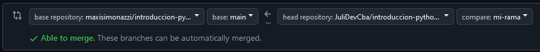

<div align="center">
  <h1>📂 Carpeta de Proyectos - Curso Introducción a Python y Micropython 🐍</h1>
</div>

¡Bienvenidos a la sección de proyectos finales del curso de MicroPython! Aquí cada grupo podrá subir su proyecto siguiendo las instrucciones detalladas a continuación. 🎉

---

## 📝 Requisitos del Proyecto

Cada grupo deberá subir una carpeta con:

1. **Código del proyecto**: Todos los archivos `.py` necesarios para ejecutar el proyecto (incluidas las librerias usadas).
2. **Esquemático del circuito**: Realizado en un programa CAD (como **Proteus**, **KiCad**, **Altium**, etc.). Se aceptan capturas o archivos de diseño de Wokwi o Thinkercad. El objetivo es ver como está conectado el circuito.
3. **Video explicativo**: Un enlace a un vide de YouTube donde se explique el proyecto y se muestre su funcionamiento práctico.
4. **Opcionales**: Pueden agregar cualquier otro archivo que consideren relevante para el proyecto, como imágenes, fotos, datasheets, documentacion usada, etc.

### 📁 Organización de carpetas
- Cada grupo debe crear una carpeta en esta seccion y debe ser nombrada con los **apellidos de los integrantes separados por guiones bajos**. Verificar en la carpeta `proyectos` que hay un ejemplo de como se debe nombrar la carpeta y la estructura de los archivos dentro.
  - **Ejemplo**: `Simonazzi_Apellido2_Apellido3`

---

## 🚀 ¿Cómo subir tu proyecto al repositorio del curso?

En la carpeta llamada proyectos (donde se encuentra este archivo README.md), colocaremos todos los proyectos del curso que cumplan con los requisitos anteriores y esten aprobados. El envio del proyecto se puede hacer por mensaje privado o, si se animan, pueden hacerlo por medio de un **Pull Request** al repositorio original directamente (les aconsejo este metodo para seguir profundizando en los conocimientos de uso de Git y Github). A continuación se detallan los pasos para subir tu proyecto mediante un Pull Request. Si tenés dudas, ¡no dudes en preguntar! 😊

### 1️⃣ Haz un fork del repositorio
1. Clic en el boton Star  y clic en Watch  al repositorio para estar al tanto de las actualizaciones.
2. Haz clic en el botón **Fork** en la parte superior derecha de este repositorio. 
3. Esto creará una copia del repositorio en tu cuenta personal de GitHub.


### 2️⃣ Clona tu fork en tu computadora (repositorio local)
1. Abre tu terminal de bash o terminal en tu IDE favorito.  
2. Clona tu fork con el siguiente comando:  
```bash
git clone direccion-de-tu-fork
```
Ejemplo con la dirección del repositorio de este curso:
```bash
git clone https://github.com/maxisimonazzi/introduccion-python-y-micropython-utnfrt.git
```
3. Navega dentro del repositorio clonado:
```bash
cd nombre-de-tu-repositorio-fork
```
4. Con esto ya estaras parado en la carpeta del repositorio local. Si haces un `ls` o `dir` deberias ver las archivos y carpetas del repositorio. Si estas utilizando Git Bash, deberias ver tambien el nombre de la rama actual en el prompt, en este caso deberia decir `(main)`. Si no estas usando Git Bash, puedes ver la rama actual con el comando `git branch` o tambien con `git status`.

### 3️⃣ Crea una rama para tu proyecto
1. Piensa en un nombre original y llamativo para el grupo. Si no se te ocurre nada, puedes usar el nombre de los integrantes del grupo.
2. Crea una nueva rama usando el nombre de tu grupo:
```bash
git branch nombre_de_tu_rama
```
3. Cambiate a la rama que acabas de crear:
```bash
git checkout nombre_de_tu_rama
```

### 4️⃣ Añade tu proyecto

1. Navega a la carpeta proyectos y crea la carpeta con los apellidos de los integrantes de tu grupo:
```bash
cd proyectos
mkdir Gonzalez_Perez_Rodriguez
```
Copia en esta carpeta todos los archivos de tu proyecto:
- Códigos (.py)
- Esquemáticos (capturas o archivos de diseño)
- Un archivo README.md que cuente y/o explique el proyecto. Al final colocar el enlace al video de YouTube. Si deseas, en este archivo puedes explayarte todo lo que quieras sobre el proyecto, como por ejemplo, objetivo, materiales o componentes utilizados, descripción del circuito, descripción del código, funcionamiento, problemas encontrados y soluciones, mejoras a futuro, instrucciones, etc.


### 5️⃣ Guarda los cambios
1. Añade todos los cambios al área de preparación (staging):
```bash
git add .
```
2. Realiza un commit explicando los cambios:
```bash
git commit -m "Presentacion del proyecto genial del grupo nombre_del_grupo"
```
3. Envía los cambios a tu repositorio remoto (fork):
```bash
git push origin nombre_de_tu_rama
```
4. Ve a tu repositorio en GitHub y verás un mensaje para crear un Pull Request. Haz clic en el botón y sigue las instrucciones.


### 6️⃣ Haz un Pull Request

1. Ve a tu repositorio en GitHub.
2. Haz clic en el botón Compare & pull request. 
3. En la página de comparación, veras a la izquierda el repositorio original y a la derecha tu repositorio. En el medio veras una flecha indicante que los cambios se van a enviar del repositorio de la derecha (tu fork) al de la izquierda (el original). Verifica que estas enviando la rama que creaste al ultimo y que deseas unirlo a la rama main del repositorio original (como se ve en la imagen).

4. Escribe un mensaje y envía el pull request.

#### ¡Listo! 🎉 Ahora solo espera a que tu solicitud sea revisada.

---

### 🌟 Consejos útiles

- Verifica que tu proyecto cumple con todos los requisitos antes de enviar el pull request.
- Si tenés problemas con Git, revisa la documentación oficial de Git o consulta con el instructor.
- ¡No olvides incluir el enlace al video en YouTube en el ```README.md``` de tu carpeta!

---

### 🛠 Herramientas recomendadas

- Git
- Thonny o Visual Studio Code
- Wokwi, Thinkercad, KiCad, Proteus, Altium, etc

---

💡 **Nota:** Este repositorio será evaluado como parte de tu aprobación final. Asegúrate de cumplir los requisitos y de enviar tu proyecto antes de la fecha límite. ¡Buena suerte! 🚀🎉🚀

```bash
[]: # (EOF)
```
