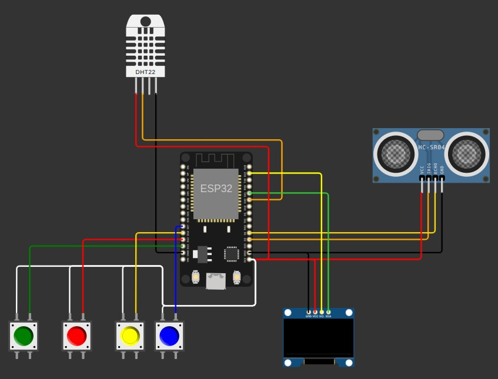

# Micropython Final Project

Este proyecto combina una interfaz gráfica intuitiva con la funcionalidad de sensores y un menú interactivo, todo programado en MicroPython. Incluye un menú dinámico en una pantalla OLED SSD1306, utiliza un sensor ultrasónico para medir distancias y un sensor DHT11 (o DHT22) para mostrar temperatura y humedad en tiempo real. Está diseñado para ejecutarse en microcontroladores compatibles, ofreciendo una solución interactiva y práctica.

---

## Características

1. **Interfaz Gráfica con OLED SSD1306**:
   - Visualización de íconos personalizados (LOGO, Trollface, Pikachu, Instagram, etc.) en formato PBM.
   - Control del menú mediante botones físicos para navegar entre opciones.

2. **Sensor Ultrasónico (HC-SR04)**:
   - Medición precisa de distancias mediante el sensor ultrasónico.
   - Visualización dinámica de las distancias medidas en la pantalla OLED.
   - Integración modular a través de la librería `hcsr04.py`.

3. **Sensor DHT11/DHT22 (Temperatura y Humedad)**:
   - Lectura de temperatura y humedad en tiempo real.
   - Visualización de los datos en un submenú de la pantalla OLED.
   - Integración modular para la gestión del sensor.

4. **Librerías Modulares**:
   - `menuoled.py`: Gestiona la lógica del menú en pantalla, incluyendo navegación y selección.
   - `ssd1306.py`: Controlador para la pantalla OLED basado en el protocolo I2C.
   - `hcsr04.py`: Proporciona las funciones necesarias para interactuar con el sensor ultrasónico HC-SR04.

5. **Aplicación Principal**:
   - `Proyecto_Final.py`: Script principal que integra las librerías, los sensores y la interfaz OLED para proporcionar una experiencia completa.

---

## Estructura del Proyecto

- **Icons/**: Contiene los archivos de imagen en formato PBM para ser desplegados en el OLED.
- **lib_mod/**:
  - `menuoled.py`: Lógica del menú.
  - `ssd1306.py`: Controlador de la pantalla OLED.
  - `hcsr04.py`: Controlador para el sensor ultrasónico HC-SR04.
- **Proyecto_Final.py**: Programa principal que integra todas las funcionalidades.

---

## Requisitos

### Hardware

- Microcontrolador compatible con MicroPython.
- Pantalla OLED SSD1306.
- Sensor ultrasónico (como el HC-SR04).
- Sensor DHT11/DHT22 (para medir temperatura y humedad).
- Botones físicos para la interacción.

### Software

- MicroPython.
- Librerías incluidas en el repositorio (`menuoled.py`, `ssd1306.py`, y `hcsr04.py`).

---

## Cómo Ejecutarlo

1. Carga los archivos del proyecto en tu microcontrolador compatible.
2. Conecta la pantalla OLED SSD1306 mediante I2C.
3. Conecta el sensor ultrasónico (GND, VCC, Trigger y Echo) según el esquema correspondiente.
4. Conecta el sensor DHT11/DHT22 a un pin digital de tu microcontrolador.
5. Ejecuta `Proyecto_Final.py` desde el entorno MicroPython.
6. Usa los botones físicos para:
   - Navegar por el menú.
   - Visualizar las distancias medidas por el sensor ultrasónico.
   - Observar los datos de temperatura y humedad del sensor DHT11/DHT22 en el submenú correspondiente.

---

## Simulación del Circuito

Puedes explorar y probar este proyecto mediante una simulación interactiva en Wokwi:  
**[Ver Simulación en Wokwi](https://wokwi.com/projects/415076751912840193)**

---

## Esquema del Circuito

A continuación se muestra el esquema de conexión del circuito:

---

## Contribuciones

Las contribuciones son bienvenidas. Si deseas mejorar el proyecto, por favor:
1. Crea un fork del repositorio.
2. Realiza tus modificaciones.
3. Envía un pull request explicando los cambios.

---

## Licencia

Este proyecto se encuentra bajo la licencia [MIT](LICENSE).