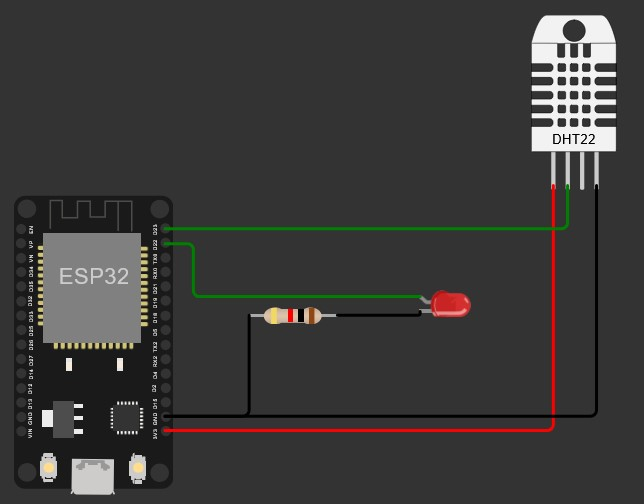

# 🛠 Proyecto: Control de Dispositivos con ESP32 y Bot de Telegram

## 📖 Descripción
Este proyecto utiliza un **ESP32** programado en **MicroPython** para interactuar con un bot de **Telegram**, permitiendo monitorear y controlar dispositivos de forma remota. El sistema mide temperatura y humedad a través de un **sensor DHT11** y controla un **LED** que simula una salida digital, como un relé u otro actuador.

---

## ⚙️ Implementación

### 1. 🖥️ Preparación del Hardware
- **Componentes necesarios:**
  - ESP32 (microcontrolador).
  - Sensor DHT11 (para medir temperatura y humedad).
  - LED (como salida digital).
  - Protoboard y cables de conexión.

- **Conexiones principales:**
  - El DHT11 se conecta al ESP32 para medir datos ambientales.
  - El LED se conecta a un pin digital para simular el control de un dispositivo.

---

### 2. 🌐 Configuración de la Red y Telegram
1. **Conexión a WiFi:**  
   Configura el ESP32 para que se conecte automáticamente a una red WiFi, permitiendo la comunicación con Telegram.

2. **Creación del Bot en Telegram:**  
   - Usa el BotFather en Telegram para generar un token único.
   - Configura comandos personalizados, como "Saber temperatura" o "Encender LED".

3. **Vinculación con el ESP32:**  
   El ESP32 utiliza el token generado para enviar y recibir mensajes desde Telegram.

---

### 3. 🛠️ Lógica del Programa
1. **Conexión Inicial:**  
   El ESP32 se conecta al WiFi y establece comunicación con Telegram.
2. **Mostrar Menú en Telegram:**  
   Muestra un menú interactivo al usuario con opciones como:
   - "Saber temperatura."
   - "Saber humedad."
   - "Encender LED."
   - "Apagar LED."
3. **Recepción y Ejecución de Comandos:**  
   - El ESP32 interpreta los comandos enviados desde Telegram.
   - Realiza acciones como leer datos del sensor o controlar el LED.
4. **Reenvío del Menú:**  
   Tras ejecutar un comando, el menú se muestra nuevamente en Telegram.

---

### 4. 🚀 Escalabilidad
Este proyecto puede ampliarse para incluir:
- Nuevos sensores o actuadores.
- Alertas automáticas basadas en condiciones específicas.
- Registro de datos en una base de datos para análisis histórico.

---

## 🎥 Video Explicativo
Puedes ver el video explicativo del proyecto en el siguiente enlace:  
[Video del Proyecto - YouTube](https://youtu.be/6Hr7xkf2j28)

---

## 🎥 Esquematico

---

## 📚 Bibliografía
1. Telegram. (n.d.). *Bots: An introduction for developers*. Recuperado de [https://core.telegram.org/bots](https://core.telegram.org/bots)

2. Telegram. (n.d.). *Bot API Library Examples*. Recuperado de [https://core.telegram.org/bots/samples](https://core.telegram.org/bots/samples)

3. Telegram. (n.d.). *From BotFather to 'Hello World'*. Recuperado de [https://core.telegram.org/bots/tutorial](https://core.telegram.org/bots/tutorial)

---

## 👨‍🎓 Autor
- **Nombres:** Francisco Silva Fernández y Juan Salazar Sánchez  
- **Curso:** Introducción a MicroPython  
- **Fecha:** 30-11-2024
