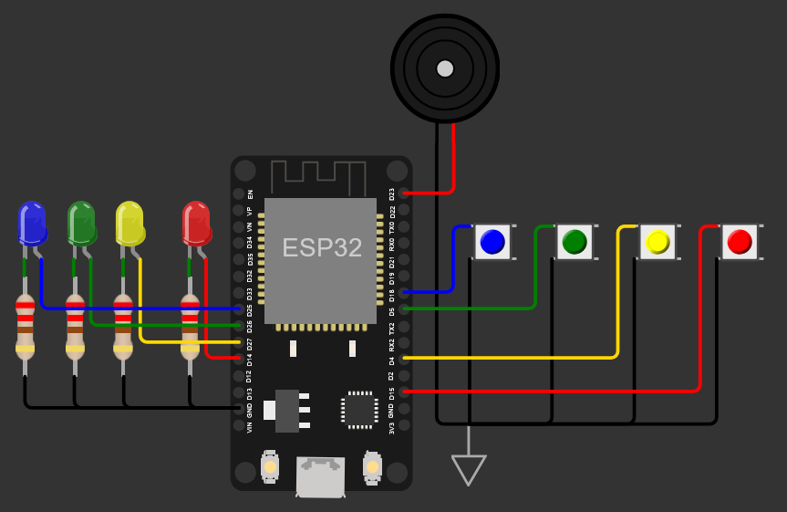

#  Juego de Simon en Micropython para ESP32 

¡Juego Simon desarrollado en MicroPython para el ESP32! Este proyecto implementa el clásico juego de memoria "Simon" utilizando un microcontrolador ESP32, 4 LEDs, 4 botones y un buzzer. Sigue las instrucciones a continuación para configurar y jugar el juego.

## 📋 Tabla de Contenidos
- Introducción
- Características
- Requisitos de Hardware
- Requisitos de Software
- Diagrama de Circuito
- Instalación
- Uso
- Jugabilidad
- Video
- Licencia

## 🎮 Introducción
El Simon es un juego de habilidad de memoria donde los jugadores deben repetir una secuencia de luces y sonidos. La secuencia se vuelve progresivamente más larga y compleja a medida que el juego avanza. Este proyecto trae el Simon a la vida utilizando un microcontrolador ESP32, convirtiéndolo en un proyecto divertido y educativo para aprender MicroPython y electrónica.

## ✨ Características
- 4 LEDs para mostrar la secuencia
- 4 botones para la entrada del usuario
- Retroalimentación sonora para secuencias correctas e incorrectas
- Nivel de dificultad incremental a medida que el juego avanza
- Sonidos de victoria y de fin de juego

## 🛠️ Requisitos de Hardware
- Microcontrolador ESP32
- 4 LEDs
- 4 botones pulsadores
- Resistencias de 100 ohms para los LEDs
- Protoboard y cables de conexión
- Zumbador (opcional para retroalimentación sonora)

## 💻 Requisitos de Software
- Firmware de MicroPython para ESP32
- Thonny IDE o cualquier otro IDE compatible con MicroPython

## 🔌 Diagrama de Circuito
Conecta los componentes como se muestra en el diagrama a continuación:

```
ESP32       LEDs/Botones/Zumbador
-----       ---------------------
GPIO14  ->  LED Rojo
GPIO27  ->  LED Amarillo
GPIO26  ->  LED Verde
GPIO25  ->  LED Azul
GPIO15  ->  Boton Rojo
GPIO4   ->  Boton Amarillo
GPIO5   ->  Boton Verde
GPIO18  ->  Boton Azul
GPIO23  ->  Buzzer
```



**Nota:** Asegúrate de conectar las resistencias de 100 ohms en serie con los LEDs para limitar la corriente y evitar dañarlos.

## 📥 Instalación
1. **Flashear el Firmware de MicroPython**: Asegúrate de que tu ESP32 esté flasheado con el firmware más reciente de MicroPython. Sigue las instrucciones [aquí](https://docs.micropython.org/en/latest/esp32/tutorial/intro.html) si es necesario.
Con Thonny IDE puedes flashear rápidamente el firmware desde el menú `Run > Configure Interpreter > Install or update MicroPython`.

2. **Configurar el IDE**: Instala Thonny IDE o cualquier otro IDE compatible con MicroPython. Configúralo para comunicarte con tu ESP32.

3. **Subir el Código**: Copia el archivo `main.py` proporcionado y cualquier otro archivo necesario a tu ESP32 usando el IDE.

## 🚀 Uso
1. **Encender**: Conecta tu ESP32 a una fuente de alimentación o a tu computadora vía USB.
2. **Comenzar a Jugar**: El juego comenzará automáticamente. Sigue la secuencia de LEDs y presiona los botones correspondientes para repetir la secuencia.

## 🎲 Jugabilidad
- El juego comienza con un solo LED encendiéndose.
- En cada ronda, se añade un nuevo LED aleatorio a la secuencia.
- Repite la secuencia presionando los botones correspondientes.
- Si repites la secuencia correctamente, el juego avanza al siguiente nivel.
- Si cometes un error, se reproduce un sonido de fin de juego y el juego se reinicia.
- La dificultad aumenta cada 5 niveles.
- ¡Alcanza el nivel 25 para ganar el juego y escuchar el sonido de victoria!

## 🎥 Video
¡Mira el juego en acción en este video!

[](https://www.youtube.com/watch?v=zOhMqD62yck)
[https://www.youtube.com/watch?v=zOhMqD62yc](https://www.youtube.com/watch?v=zOhMqD62yck)

## 📜 Licencia
Este proyecto está licenciado bajo la Licencia MIT. Siéntete libre de usar, modificar y distribuir el código como mejor te parezca. No olvides atribuir al autor y compartir tus mejoras. ¡Diviértete jugando al Simon! 😄

¡Feliz programación! 😊